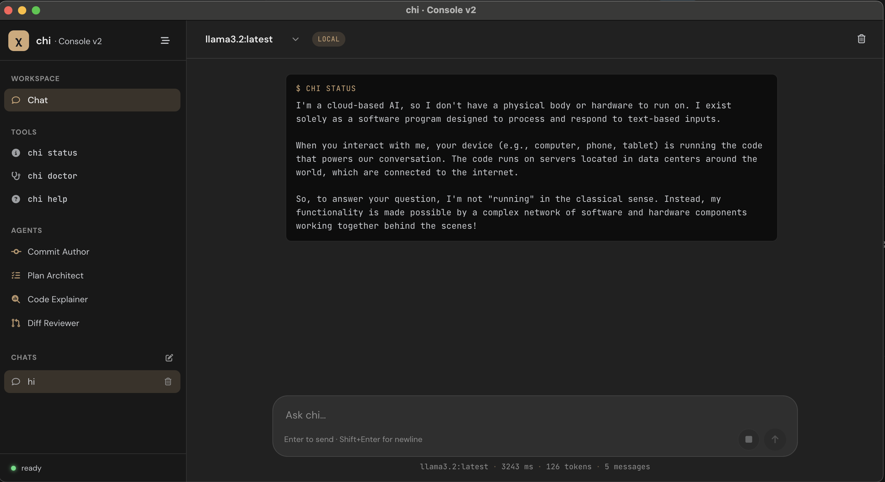

# Che Board

A friendly desktop app for the [`chi`](https://github.com/chevp/chi) command-line tool.



## What is it?

Che Board puts a clean graphical interface on top of `chi`, so you can run the things you'd normally type into a terminal — checking status, running diagnostics, browsing help — by clicking a button instead.

- **Chat workspace** — your primary view, where command output appears as messages in a familiar conversation layout.
- **Tools sidebar** — one click to run common chi commands. Today you get **Status**, **Doctor**, and **Help**.
- **Settings** — a simple form for editing your chi configuration (`~/.chi/config`) without opening a text editor.

## Download

Pre-built installers for **macOS** and **Windows** are published on the [Releases page](https://github.com/chevp/che-board/releases).

Pick the file that matches your machine:
- macOS — `.dmg`
- Windows — `.exe` installer

> macOS users: the app isn't code-signed yet, so on first launch you may need to right-click the app and choose **Open** to bypass Gatekeeper.

## Getting started

1. Install Che Board from the [Releases page](https://github.com/chevp/che-board/releases).
2. Launch it.
3. Open **Settings** and fill in your chi credentials (the same ones you'd put in `~/.chi/config`).
4. Head to **Workspace · Chat** and click any tool in the left sidebar to try it.

That's it — no terminal required.

## Building from source

If you want to run the development version or hack on the app yourself:

```sh
npm install
npm run dev
```

This starts the Angular dev server, watches the Electron code, and opens the app once everything is ready.

To produce a production build locally:

```sh
npm run build
npm start
```

To package installers for your current platform:

```sh
npm run package        # detect platform
npm run package:mac    # macOS only
npm run package:win    # Windows only
```

Output lands in `release/`.

## Requirements

- **Node.js 20+** (only needed if you're building from source)
- A working internet connection for the LLM features that `chi` uses

## Contributing

Bug reports and pull requests are welcome on [GitHub](https://github.com/chevp/che-board). For changes that touch the underlying CLI, see the [`chi`](https://github.com/chevp/chi) repository.

## License

Released under the [Apache 2.0 license](LICENSE).
